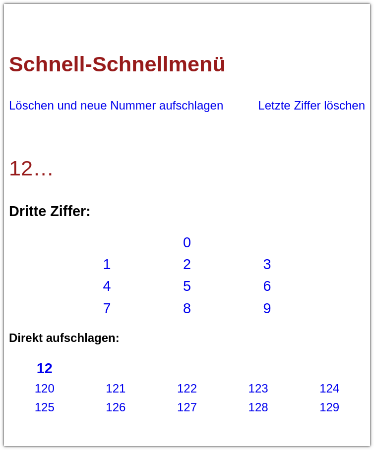

# Schnell-Schnellmenü für GHS EPUB

Das, was ich am meisten am GHS vermisse, ist ein besseres und schnelleres Schnellmenü. Also habe ich mir selber eins erstellt.

Natürlich kann ich nicht einfach Kopien des EBooks and Andere weitergeben, aber ich kann meine Änderung und ein Werkzeug zur Anwendung dieser auf eine originale Version des EBooks zur Verfügung stellen.

Das passiert nur lokal im Browser, es werden keine Dateien auf andere Geräte oder Server hoch- bzw. heruntergeladen.

***Behalte immer ein Backup deiner Originaldatei!***

